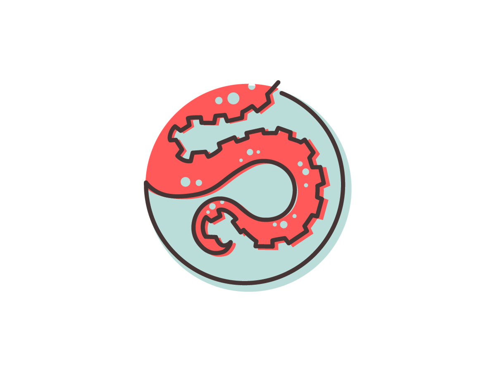

# Bulmapress + SeaMonster Studios Frontend Build System with ReasonML

## Usage & Setup

1. Clone theme repo into WordPress install.
2. Run `yarn` to install dependencies.
3. Update `vhost` variable in `gulpfile.babel.js` to match your virtual host.
4. Run `yarn start` to start the bucklescript compiler and dev server with non-minified assets being loaded into site

### Setup for production

1. Run `yarn build` to build minified assets

### Images, Fonts, and No-nos

Images, fonts, and other static assets (non-styles, non-scripts) should be placed in the `./assets` directory, and _NOT_ in the `./assets/build` directory. Also be sure to not manually modify anything in the `./assets/build` directory as these are generated files and will be overridden when using the gulp build system.

## Rebasing with Bulmapress

1. Rebase latest changes with -xours. The one thing we change.
2. Replace the files in `./src/scripts/bulmapress` with what comes from the rebase in `./frontend/js`, except for `customizer.js`. Update `import` statments in `./src/scripts/index.js`
3. Move `customizer.js` from `./frontend/js` to `assets` (yes, replace it).
4. Move `./frontend/bulmapress.sass` and `./frontend/sass` to `./src/styles/`
5. Rename `sass` to `bulmapress`, update `@import` statments in `bulmapress.sass`. And replace the `@import "./node_modules/bulma/bulma"` statment with `@import "../../node_modules/bulma/bulma"`
6. Copy all dependencies found in `frontend/bulmapress/package.json` to `./package.json`
7. Delete `./frontend` dir.

## A WordPress flexbox theme

Hi. I'm a WordPress flexbox theme called Bulmapress.

- Based on [Underscores](http://underscores.me/)
- [Bulma](http://bulma.io) integration
- Requires at least: [WordPress](http://wordpress.org) 4.0
- Tested up to: [WordPress 5.0.3](https://wordpress.org/download/)
- Stable tag: 0.0.3
- License: [GNU General Public License v2 or later](http://www.gnu.org/licenses/gpl-2.0.html)

## Demo

[bulmapress.scops.com](https://bulmapress.scops.com/)

## Installation

1. In your admin panel, go to Appearance > Themes and click the Add New button.
2. Click Upload and Choose File, then select the theme's .zip file. Click Install Now.
3. Click Activate to use your new theme right away.

## Frequently Asked Questions

_Does this theme support any plugins?_

Bulmapress includes support for Infinite Scroll in Jetpack.

## Changelog

- _v0.0.4 - Mar 02 2019_:
  - **Updated Bulma to 0.7.4**
  - **Switched to [Bulma-Navwalker](https://github.com/Poruno/Bulma-Navwalker)**
  - **Add Child-theme support**
- _v0.0.3 - Jan 19 2019_: **Updated Bulma to 0.7.2**
- _v0.0.2 - Dec 30 2017_: **Updated Bulma to 0.6.1**
- _v0.0.1 - Jan 04 2017_ : **Initial draft**

## Credits

- Based on Underscores http://underscores.me/, (C) 2012-2016 Automattic, Inc., [GPLv2 or later](https://www.gnu.org/licenses/gpl-2.0.html)
- bulma.io http://bulma.io/, (C) 2017 Jeremy Thomas, [MIT](http://opensource.org/licenses/MIT)
- https://github.com/Poruno/Bulma-Navwalker, (C) 2018 Carlo Operio - @Poruno, [MIT](http://opensource.org/licenses/MIT)
